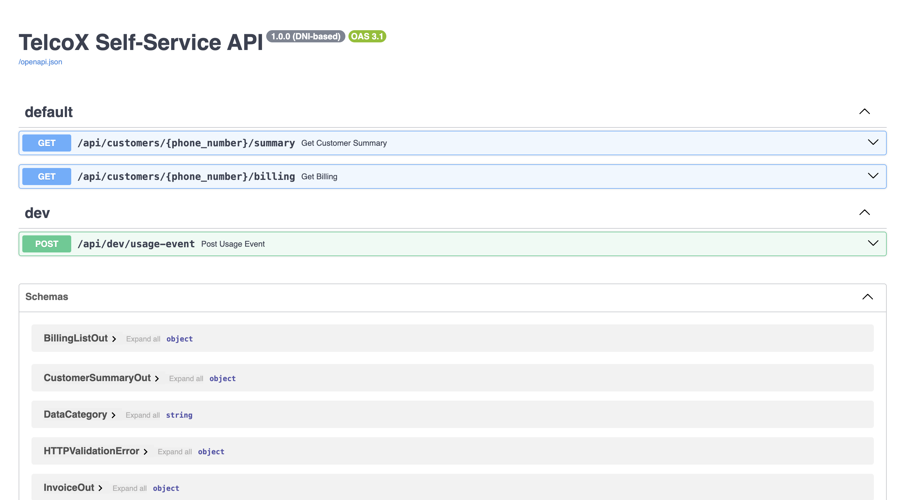

# 📡 Api Reports Backend

Backend desarrollado en **Python + FastAPI**, estructurado con **Arquitectura Hexagonal (Ports & Adapters) e Inyeccion de Dependencias** y desplegado mediante **Docker**.  
Provee servicios REST y WebSockets para el manejo de clientes, consumos, planes y facturación.

---

## 🔧 Requisitos

- [Docker](https://docs.docker.com/get-docker/)  
- [Docker Compose](https://docs.docker.com/compose/install/)  

> ⚠️ No necesitas instalar Python ni dependencias manualmente, todo se ejecuta dentro de contenedores.

## 🗄️ Migraciones / Seed de Base de Datos

El proyecto incluye scripts SQL de inicialización.

---

## ▶️ Ejecución del proyecto
 

```bash
git clone https://github.com/ojacome/api-reports.git
cd api-reports
docker compose up --build
docker compose exec -T db sh -c 'mysql -utelcox -ptelcox telcox' < db/seed_usage.sql
```

## 🧩 Arquitectura Hexagonal

Este backend sigue el estilo de Arquitectura Hexagonal (Ports & Adapters):

 - Domain (Core)
Contiene las entidades, value objects y use cases que representan la lógica de negocio.
Ejemplo: Invoice, DataPlan, ApplyUsageEventUseCase.

  - Application (Use Cases)
Orquesta la lógica usando los puertos (interfaces).
Ejemplo: GetSnapshotByPhoneNumberUseCase.

  - Infrastructure (Adapters)
Implementación concreta de acceso a base de datos, servicios externos, repositorios.
Ejemplo: SqlAlchemyPlanRepository, SqlAlchemyUsageRepository.

  - Presentation (Entrypoints)
Endpoints REST y WebSocket expuestos con FastAPI.
Ejemplo: /api/customers/{phone}/summary, /ws/usage.

Este diseño permite independencia de frameworks y facilita el testing y escalabilidad.


## 📌 Endpoints principales

Consumo en tiempo real (WebSocket)
ws://localhost:8000/ws/usage?phone_number={number}

Resumen de cliente (REST)
GET http://localhost:8000/api/customers/{phone}/summary

Historial de facturas (REST)
GET http://localhost:8000/api/customers/{phone}/billing

## 📌 SWAGGER
Podemos usar la documentacion de swagger para probar nuestra apic contiene lo necesario para testear

http://localhost:8000/docs

POST http://localhost:8000/api/dev/usage-event

Lo usamos para simular el consumo de datos

